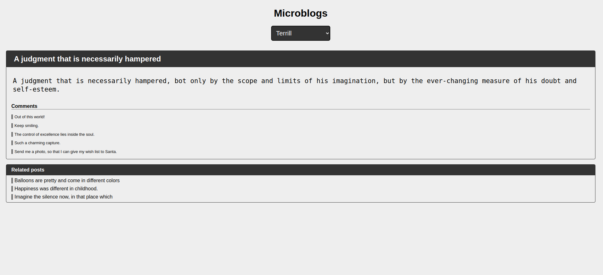

# MicroBlogs
Foi construida uma página para leitura de posts de várias pessoas a partir da API [https://dummyjson.com/users](https://dummyjson.com/users).

## :computer: Visualize este projeto:
Acesse a página aqui:
[https://geovannaotoni-microblogs.surge.sh/](https://geovannaotoni-microblogs.surge.sh/)

## :bulb: Habilidades:
Feito a partir dos conhecimentos de CSS, HTML, JavaScript, DOM, Eventos, API, NPM, Vite, Promisses e Fetch.
